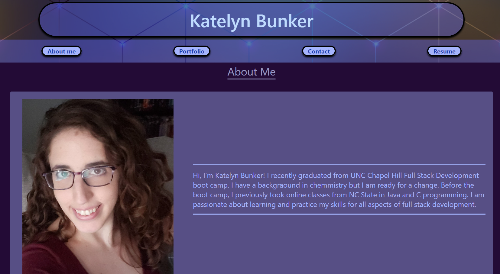
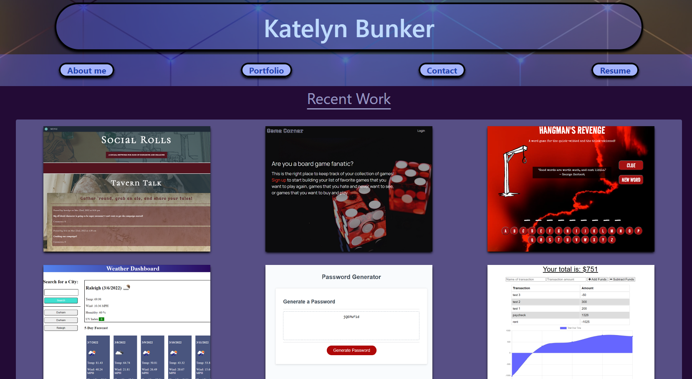

# React Portfolio

## Description

This is a single page react application that showcases my recent work. The navigation links will take you to the about me section, the portfolio section, the section to contact me, and also my resume with a link to download my resume. 

## Install

To install this app, clone the github repositiory and run `npm install` to install the necessary packages.

## Usage

Once the app and packages have been installed, run `npm start` to start the server. Since the app has been deployed to github pages, you can see the deployed app [here](https://kerbunker.github.io/react-portfolio/).

## Questions

Contact me through [GitHub](https://github.com/kerbunker/react-portfolio) or through email at <kerbunker@gmail.com>.